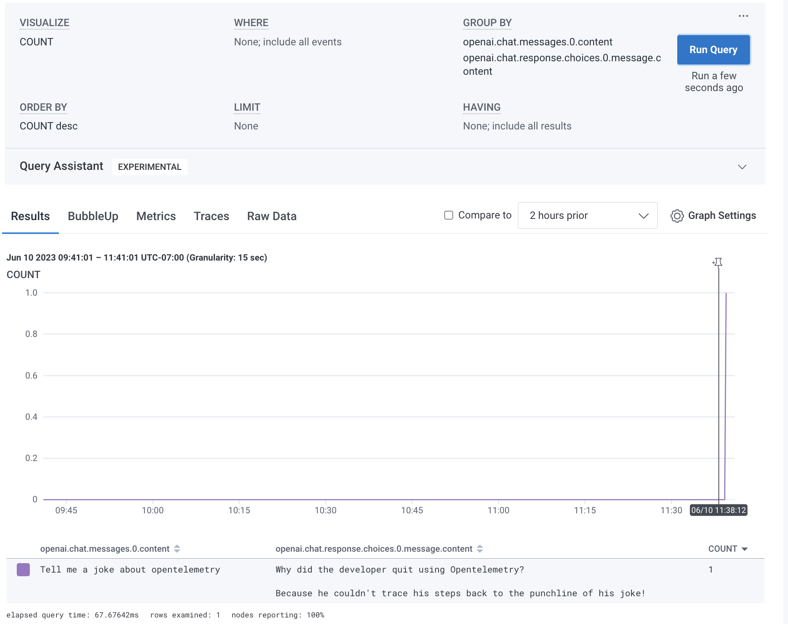

How to run:

1. Reame `env.example` to `.env`
2. Put your openai API key in there

Now:

```shell
poetry install
poetry run opentelemetry-bootstrap -a install
poetry run opentelemetry-instrument \
  --traces_exporter console \
  --metrics_exporter none \
  --logs_exporter none \
  python chat.py
```

You will see a big blob of JSON.

To see it in honeycomb:

```
export OTEL_EXPORTER_OTLP_ENDPOINT="https://api.honeycomb.io"
export OTEL_EXPORTER_OTLP_HEADERS="x-honeycomb-team=YOUR-API-HONEYCOMB-API-KEY"
export OTEL_SERVICE_NAME="your-service-name"
poetry install
poetry run opentelemetry-bootstrap -a install
poetry run opentelemetry-instrument python chat.py
```

And then you can query it and see a trace (in this case it's just one span so I'm not showing that):

